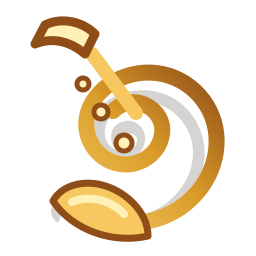

<section class="hero">
  

    <h1>SwingBig.Band</h1>
    
A hard-swinging big band blog for section notes, gig announcements, set lists, and the small moments that happen between the first count-off and the final shout chorus.

    
<a class="md-button md-button--primary" href="blog/">Read the blog</a> <a class="md-button" href="gigs/">See upcoming gigs</a>

  

  
</section>

## From the bandstand

<section class="quick-card" markdown>
## Next call

**Friday, August 14**  
Doors at 7:00 PM, downbeat at 8:00 PM.

[Gig details](gigs.md)
</section>

<section class="quick-card" markdown>
## Latest chart

The book just picked up a brighter opener built around brass punches, walking bass, and a sax soli that needs room to breathe.

[Repertoire notes](repertoire.md)
</section>

<section class="quick-card" markdown>
## Blog focus

Arrangements, rehearsal notes, section features, listening recommendations, and stories from the rhythm section.

[All posts](blog/index.md)
</section>

## Current Set Shape

<ul class="set-list">
  <li>Classic Basie pocket and relaxed medium swing</li>
  <li>Latin changes for the second set lift</li>
  <li>Ballad feature with tenor and flugelhorn colors</li>
  <li>Finale chart with full brass shout chorus</li>
</ul>
